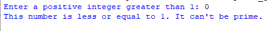
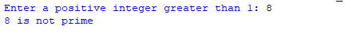

## Description
This program determines whether a user-entered integer is a prime number or not. Prime numbers are defined as positive integers greater than 1 that have exactly two distinct positive divisors: 1 and themselves. This program calculates the number of divisors for the entered integer and uses this count to make the determination. If the user enters a non-integer, it will provide an error message.
## Example
♡ Example 1   
  
♡ Example 2  
  
♡ Example 3  
  
♡ Example 4  

